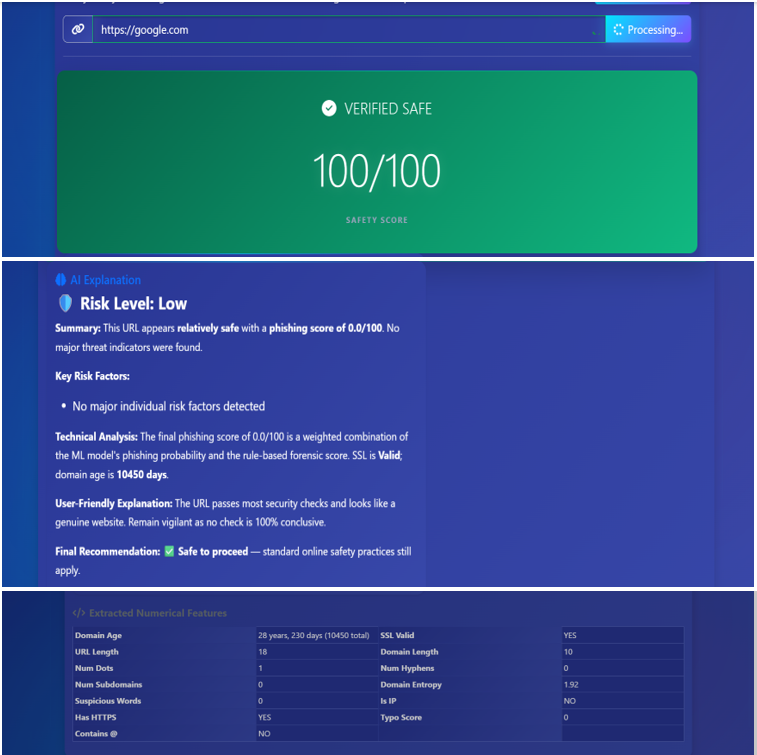
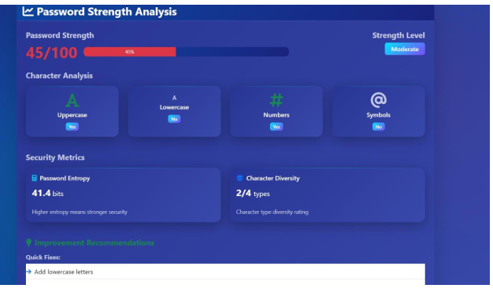

# 🛡️ CyberGuard Pro - AI Based Phishing Detection and Password Protection System
**Comprehensive Cybersecurity Analysis Platform**

CyberGuard Pro is an advanced, AI-powered web application designed to protect users from modern online threats. At its core, it features a **centralized AI orchestration engine for coordinated multi-agent decision-making** that combines Machine Learning (ML), digital forensics (Heuristics), and Natural Language Processing (LLM) to detect phishing websites with enterprise-grade accuracy. It also provides tools for password strength analysis and secure password generation.

---


## 📸 Screenshots & Demo
**🎥 Video Demo:**
[Watch on YouTube](https://youtu.be/8vwuOtdhI9Y)


## 🚀 Key Features

*   **🤖 AI-Powered URL Scanner (Phishing Detection)**
    *   **Machine Learning (Random Forest):** Predicts phishing probability using a Random Forest classification model trained on engineered URL features.
    *   **Rule-Based Forensics:** Analyzes WHOIS domain registration age, SSL certificate validity, domain entropy, and typosquatting signals.
    *   **Explainable AI (XAI):** Automatically translates complex statistical data into an easy-to-read, user-friendly security report.
*   **🔑 Password Utilities**
    *   **Strength Analyzer:** Checks passwords against brute-force resistance and common dictionary vulnerabilities.
    *   **Secure Generator:** Creates cryptographically secure passwords based on custom constraints.
*   **📊 User and Admin Dashboards**
    *   Track history and analyze personal security trends using interactive `Chart.js` graphs.
    *   Download detailed security reports in PDF and CSV formats.
*   **✨ Modern Interface**
    *   A premium, responsive "neon/glassmorphism" aesthetic built with Bootstrap 5 and custom CSS.

---

## 🚀 Enterprise AI Capabilities

CyberGuard Pro is designed using modern enterprise AI principles:

- **Multi-Agent Orchestration Engine**  
  Decoupled agents (Rule, ML, LLM) coordinated through a centralized decision engine.

- **Hybrid AI Decision System (ML + Rules)**  
  Combines statistical learning with real-time security forensics for improved accuracy.

- **Explainable AI (XAI)**  
  Converts raw risk scores into human-readable cybersecurity insights.

- **Lightweight RAG Approach**  
  Context-aware explanations using threat intelligence patterns.

- **Scalable API-Driven Architecture**  
  Designed for integration with enterprise systems via RESTful APIs.

---

## 💼 Business Value

- Helps detect phishing attacks in real-time
- Reduces risk of credential theft for users
- Can be integrated into enterprise security pipelines
- Scalable architecture suitable for SaaS security platforms
- Built with REST APIs enabling real-time integration with external systems

---

## 📈 Model Performance

- Random Forest Accuracy: ~90%+ (evaluated on phishing dataset)
- Improved detection reliability using hybrid ML + rule-based approach

## ⚡ Performance Optimization

- Parallel Rule Execution reduced scan time by ~60%
- Cached results improve repeated scan speed by ~70%

---

## ⚙️ Architecture & Tech Stack

This platform is built using a modern, scalable architecture:

**Backend:**
*   **Framework:** Python 3 + Flask (Modular routes using Blueprints)
*   **Security & Auth:** Flask-Login, Flask-Bcrypt, Werkzeug Security
*   **Database:** SQLAlchemy ORM (compatible with SQLite/MySQL)

**Artificial Intelligence Layer:**
*   **Scikit-Learn (sklearn):** Powers the Random Forest phishing prediction model (`phishing_rf_model.pkl`).
*   **Multi-Agent System:** Decoupled `RuleAgent`, `MLAgent`, and `LLMAgent` combined through an `AIOrchestrator`.
*   **OpenAI API (Optional):** Used for generating explainable security insights (XAI layer); falls back to deterministic heuristics if no API key is provided.

**Frontend:**
*   HTML5 / CSS3 / JavaScript
*   Bootstrap 5
*   Chart.js (Analytics) & Marked.js (Markdown parsing)

---

## 🔗 API Endpoints

### POST `/analyze-url`
**Request:**
```json
{
  "url": "https://example.com"
}
```

**Response:**
```json
{
  "final_score": 87.5,
  "risk_level": "High",
  "ml_score": 0.92,
  "rule_score": 0.78,
  "explanation": "This URL shows signs of typosquatting..."
}
```

---

## 🌐 Scalability & Future Enhancements

- Redis-based distributed caching
- Deployment on cloud platforms (Azure/AWS)
- Integration with SIEM tools
- Real-time threat intelligence feeds

---

## 🛠️ Installation & Setup

### Requirements
*   Python 3.8+
*   Pip package manager

### 1. Clone the Repository
```bash
git clone <your-repository-url>
cd UrlSecurityScanner-2
```

### 2. Set Up a Virtual Environment (Recommended)
```bash
python -m venv venv
# On Windows:
venv\Scripts\activate
# On macOS/Linux:
source venv/bin/activate
```


### 3. Install Dependencies
```bash
pip install -r requirements.txt
```

### 4. Environment Variables (Optional)
Create a `.env` file in the root directory to configure integrations:
```env
# Optional: Enables dynamic AI text generation
OPENAI_API_KEY=sk-your-api-key-here
```


### 5. Run the Application
Run the orchestrator script to properly boot the application:
```bash
python run.py
```
The server will start on `http://127.0.0.1:5000`.


---

## 📁 Project Structure

```text
UrlSecurityScanner-2/
├── app.py                      # Application factory and initialization
├── run.py                      # Main entrypoint to start the server
├── controllers/
│   └── web_routes.py           # Web endpoints and Flask routes
├── models/
│   └── database.py             # SQLAlchemy schemas (User, AIScan, etc.)
├── services/
│   ├── orchestrator.py         # Multi-Agent coordinating engine
│   ├── agents/
│   │   ├── ml_agent.py         # Machine learning prediction handler
│   │   ├── rule_agent.py       # Domain/SSL forensics extractor
│   │   └── llm_agent.py        # Explainable AI report generator
│   └── common/
│       ├── report_generator.py # PDF/CSV generation logic
│       └── cache.py            # In-memory performance caching
├── ml_models/
│   └── phishing_rf_model.pkl   # Trained Random Forest Model
├── templates/                  # Frontend HTML templates
└── static/                     # CSS, Javascript, and Images
```

---

## 🧪 Testing

- Unit Testing using `pytest`
- API Testing using Postman
- Manual validation with known phishing datasets

---

## 🛡️ Trust & Privacy
All scans and URL analysis metrics are logged locally within the database to power the dashboard. The application is designed to be autonomous and can function entirely offline/without third-party APIs (excluding the optional OpenAI enhancement and WHOIS library network calls to registry servers).

## 📄 License
This project is proprietary. All rights reserved.

---

**Features**

**SAFE WEBSITE**



**PASSWORD STRENGTH CHECKER**



**Dashboard**


---

## 🧠 Final Note

CyberGuard Pro demonstrates an enterprise-grade, production-ready cybersecurity architecture by combining rule-based forensics, machine learning prediction, and generative AI into a unified, scalable platform designed for real-world threat detection. 

**Developed By AARTHI V G**
                                                                                              
